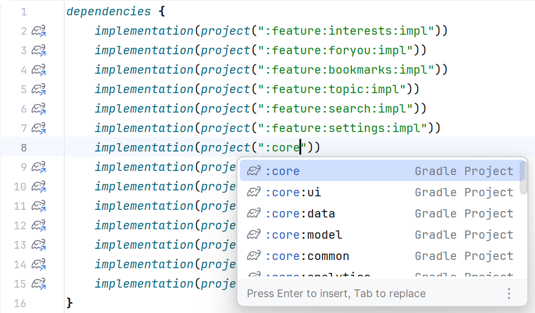
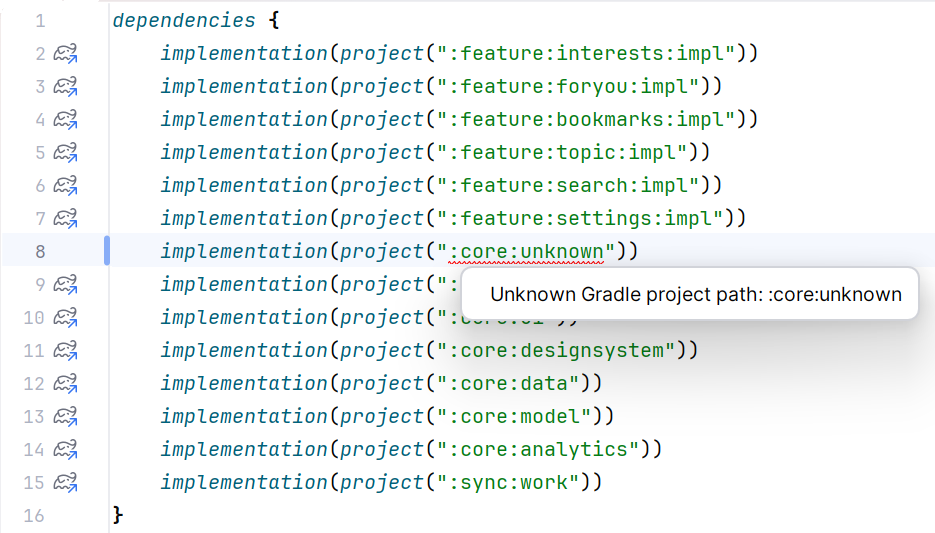

<h1>
  
  Gradle-Project-Paths
</h1>

> An IntelliJ plugin that helps autocomplete Gradle project paths.

| Path Completion | Unknown Module |
|-----------------|----------------|
| <picture><source media="(prefers-color-scheme: dark)" srcset="art/path-completion-dark.png"></picture> | <picture><source media="(prefers-color-scheme: dark)" srcset="art/unknown-module-dark.png"></picture> |

## Installation

- Using the IDE built-in plugin system:

  <kbd>Settings/Preferences</kbd> > <kbd>Plugins</kbd> > <kbd>Marketplace</kbd> > <kbd>Search for "Gradle-Project-Paths"</kbd> >
  <kbd>Install</kbd>

- Using JetBrains Marketplace:

  Go to [JetBrains Marketplace](https://plugins.jetbrains.com/plugin/32671) and install it by clicking the <kbd>Install to ...</kbd> button in case your IDE is running.

  You can also download the [latest release](https://plugins.jetbrains.com/plugin/MARKETPLACE_ID/versions) from JetBrains Marketplace and install it manually using
  <kbd>Settings/Preferences</kbd> > <kbd>Plugins</kbd> > <kbd>⚙️</kbd> > <kbd>Install plugin from disk...</kbd>

- Manually:

  Download the [latest release](https://github.com/SimonMarquis/Gradle-Project-Paths/releases/latest) and install it manually using
  <kbd>Settings/Preferences</kbd> > <kbd>Plugins</kbd> > <kbd>⚙️</kbd> > <kbd>Install plugin from disk...</kbd>

---
Plugin based on the [IntelliJ Platform Plugin Template][template].

[template]: https://github.com/JetBrains/intellij-platform-plugin-template
